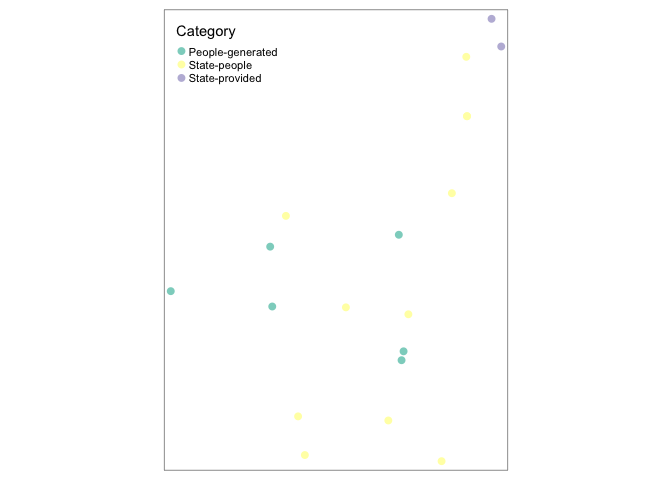

Hougang
================
Gareth
5/20/2020

``` r
library(tidyverse)
```

    ## ── Attaching packages ────────────────────────────────────────────────────────────────────────────────────────────── tidyverse 1.3.0 ──

    ## ✓ ggplot2 3.3.0     ✓ purrr   0.3.3
    ## ✓ tibble  2.1.3     ✓ dplyr   0.8.5
    ## ✓ tidyr   1.0.2     ✓ stringr 1.4.0
    ## ✓ readr   1.3.1     ✓ forcats 0.5.0

    ## ── Conflicts ───────────────────────────────────────────────────────────────────────────────────────────────── tidyverse_conflicts() ──
    ## x dplyr::filter() masks stats::filter()
    ## x dplyr::lag()    masks stats::lag()

``` r
library(sf)
```

    ## Linking to GEOS 3.7.2, GDAL 2.4.2, PROJ 5.2.0

``` r
library(tmap)
library(tmaptools)
library(extrafont)
```

    ## Registering fonts with R

``` r
hougangspaces<-read_csv(here::here('irpdata/Hougang19052020.csv'))
```

    ## Parsed with column specification:
    ## cols(
    ##   `Location ID` = col_double(),
    ##   Name = col_character(),
    ##   Category = col_character(),
    ##   `Type of Space` = col_character(),
    ##   Security = col_character(),
    ##   Demarcation = col_character(),
    ##   Cleanliness = col_character(),
    ##   `Seating Types` = col_character(),
    ##   `Seating Capacity` = col_character(),
    ##   `Electrical appliances` = col_character(),
    ##   `Ornaments and Decorations` = col_character(),
    ##   lat = col_double(),
    ##   lon = col_double()
    ## )

``` r
hougangspaces<-hougangspaces %>% 
  st_as_sf(coords = c('lon', 'lat'))

st_crs(hougangspaces)<-"+proj=longlat +datum=WGS84 +no_defs"
```

``` r
tmap_mode("plot")
```

    ## tmap mode set to plotting

``` r
tm_shape(hougangspaces)+tm_dots(size = 0.3,col = "Category")
```

<!-- -->
